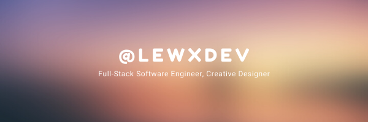

## About ##
Hi! I'm a full-stack software engineer and life-long technologist with focused experience in application design, a second generation [Nextech Catapult](https://nextech.org/programs/catapult/), and interned at [Kenzie Academy](https://kenzie.academy) prior to graduating from their legacy full-stack software engineering program. I'm passionate about learning new technologies and building solutions to problems.

## Toolkit ##

